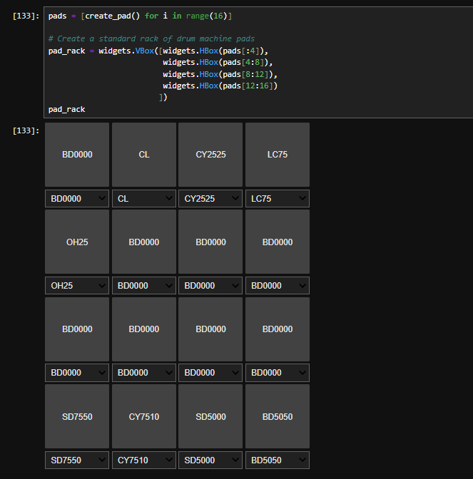
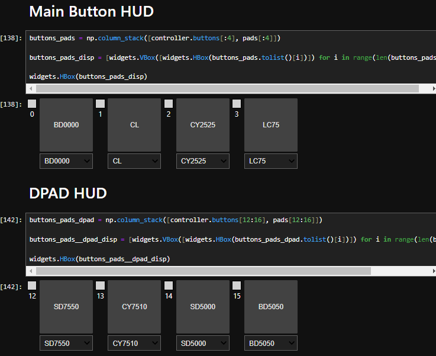

# Jupyter Drums

## Portable extensible drumkit tools built using ipytone and jupyter widgets

- This repo is currently under construction but sofar I have included some notebook files that have examples of very basic drum machines usingh ipytone, jupyter widgets and samples from drumkito.com

Here is an example of the most basic implementation in a classic drum pad 8 x 8 grid:

Here is an other example using those same assets but used in an interactive HUD for a controller UX

## Stay tuned more content to come

### Roadmap

- Recreate the Classic TR-808 and TR-909 circuts algorithmically and play them in ipytone 
- Make a proper module and upload to pip
- Create ossciloscope widget for real time analysis of ipytone that is smoother than current matplotlib implementation
- Create sequencer interface that mimics the TR-808 sequencer interface